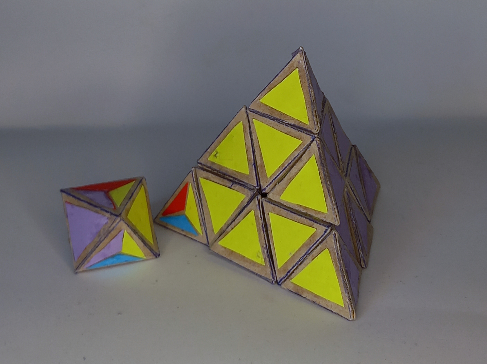

# Dominik's 4D Pyraminx

    

    **4D Shape:** 5-cell

    **Physical Shape:** Tetrahedron + small Octahedron

    **Pieces:** 5 4c, 10 3c

    **Magnets:** 60 (better version needs 180)

    **Completed:** 2023 Dec 28

## History

Based on some ideas for the 4D pyraminx Dominik first created a paper model in mid December. After some suggestions from Melinda Green he created the current prototype with magnets which was the first functioning version of this design.

## How does it work?

The puzzle can be moved like a pyraminx but with some additional legal moves. The edges that are in the position of the trivial tips can't legally be twisted. For more details go [here](How-does-it-work.md).
